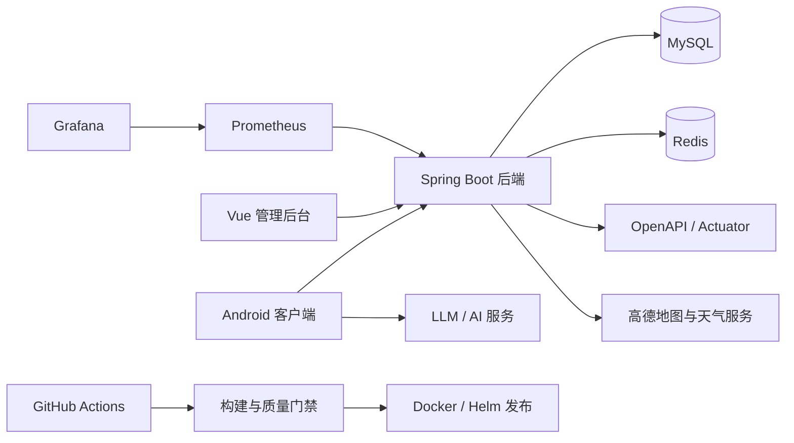
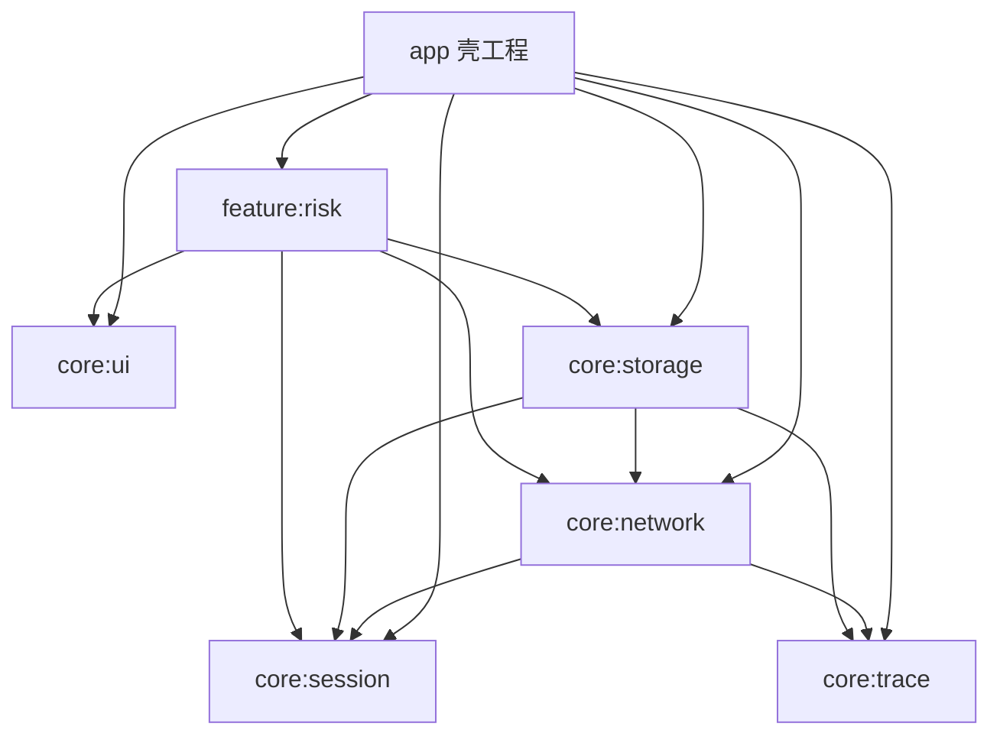
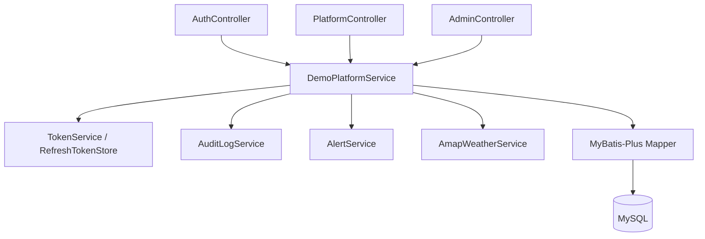

# 低空驿站一站式数字化服务平台项目说明书

版本号：`v2.2.0`  
修订人：Trae GPT-5.4  
修订日期：2026-04-26  
适用场景：计算机程序设计大赛评审、项目答辩、技术路演、成果归档

---

## 1. 文档说明

### 1.1 编制依据

本说明书基于当前仓库中的实际代码、构建脚本、测试资产与流水线配置编制，重点依据包括：

- Android 客户端源码：`app/`、`core/`、`feature/`
- 后端源码：`server/`
- 管理后台源码：`admin-web/`
- 构建与流水线：`build.gradle.kts`、`settings.gradle.kts`、`.github/workflows/`
- 当前仓库内的项目说明、源码结构与本地可复核验证结果

### 1.2 文档目标

- 面向评委清晰说明项目背景、业务价值和系统完整性
- 面向技术答辩展示架构设计、实现原理和工程深度
- 面向交付与复现提供部署运行、测试验证和演示方案

---

## 2. 项目背景与意义

### 2.1 行业背景

低空经济场景具有任务链路长、协同角色多、执行环境复杂的特点。围绕无人机巡检、测绘、安防、物流与培训等业务，通常需要经历任务发布、接单履约、支付结算、飞行申请、禁飞区核验、风险感知、消息协同、售后反馈与平台监管等多个环节。传统方式往往依赖微信群、电话沟通和离散表格，存在以下普遍痛点：

- 业务状态分散，任务、订单、审批、消息缺乏统一工作台
- 合规能力薄弱，禁飞区信息、天气风险、审批流程容易断点
- 弱网环境频发，移动端在山区、园区、户外作业时易出现写操作丢失
- 平台治理不足，缺乏审计追踪、回滚机制、运维监控与质量门禁

### 2.2 项目意义

本项目并非单纯的页面展示型应用，而是一个围绕低空业务闭环构建的三端协同平台：

- Android 客户端承担移动执行工作台，服务飞手、企业、机构等一线角色
- Spring Boot 后端承担鉴权、业务编排、持久化、审计、天气服务和管理接口
- Vue 管理后台承担治理、分析、设置、工单处理与日志追踪

其意义体现在三个层面：

1. **业务层面**：把任务、订单、支付、合规、培训、消息、反馈等核心场景串成完整闭环。
2. **工程层面**：构建了多模块 Android、单体分层后端、配置驱动 Web 管理台和 CI/CD 运维资产。
3. **竞赛层面**：相比只做 UI 展示的作品，本项目更强调真实数据流、状态流转、容错机制和平台治理能力。

---

## 3. 项目定位与总体目标

### 3.1 项目定位

低空驿站一站式数字化服务平台是一套面向低空经济作业场景的综合信息系统，面向以下四类角色提供差异化服务：

| 角色 | 核心目标 |
| --- | --- |
| 飞手 | 接单执行、订单支付、飞行申请、风险查看、课程报名、消息协同 |
| 企业 | 企业注册、材料上传、任务发布、项目推进、飞手协同、工单反馈 |
| 机构 | 课程维护、培训资源供给、培训过程管理 |
| 管理员 | 平台治理、用户管理、项目与订单监管、分析报表、审计日志、设置维护 |

### 3.2 建设目标

- 建设 Android、后端、管理端三端协同的一站式产品
- 打通注册登录、任务、订单、支付、合规、培训、消息、反馈、治理闭环
- 形成可构建、可部署、可演示、可答辩、可继续演进的竞赛级工程底座

---

## 4. 核心功能特性

### 4.1 面向业务闭环的核心能力

1. **注册登录与会话恢复**
   - 支持登录、注册、刷新令牌、自动登录
   - 企业注册必须先补齐企业材料
   - 网络异常时可切换本地演示模式保证展示连续性

2. **任务与订单闭环**
   - 企业发布任务、更新任务、重新发布任务
   - 飞手浏览任务详情、查看地图、创建订单
   - 订单支持支付并同步状态到后端和管理台

3. **合规与风控**
   - 支持禁飞区查看、维护与地图展示
   - 支持飞行申请提交与企业侧审批管理
   - 首页接入天气与飞行适宜性评估
   - 风险告警接口与页面形成独立风控入口

4. **培训与供给侧管理**
   - 飞手可查看课程、报名课程
   - 企业/管理员可创建、编辑、发布、删除课程
   - 培训页提供课程统计与图表展示

5. **消息协同与反馈治理**
   - 企业与飞手之间支持会话列表、会话详情、消息发送
   - 支持已读回执同步与本地缓存展示
   - 用户可提交帮助与反馈工单，管理员可在后台回复和闭环

6. **平台治理与运营分析**
   - 管理端提供概览、用户、项目、订单、分析、设置、日志、工单
   - 后端提供 `/api/admin/**` 聚合管理接口
   - 审计日志、设置维护、CSV 导出、反馈工单联动形成治理链

### 4.2 面向复杂场景的工程能力

- 弱网离线补偿
- 本地缓存与 Demo 回退
- 请求级 `requestId` 追踪
- 崩溃日志落盘
- 多环境构建与签名发布
- CI 检查、构建产物归档、文档门禁

---

## 5. 技术栈组成

### 5.1 Android 客户端

| 类别 | 技术栈 |
| --- | --- |
| 语言与架构 | Java 17、XML、ViewBinding、Navigation Component |
| UI 与交互 | AndroidX、Material 3、Lottie |
| 网络通信 | Retrofit 2.11、OkHttp 4.12、Gson |
| 地图与天气 | 高德地图 SDK、高德天气 API |
| 本地存储 | SharedPreferences、AndroidKeyStore、Room、FileCache |
| 后台任务 | WorkManager |
| 数据可视化 | MPAndroidChart |
| 测试 | JUnit 4、Robolectric、Espresso、JaCoCo |

### 5.2 后端服务

| 类别 | 技术栈 |
| --- | --- |
| 基础框架 | Spring Boot 3.2.12 |
| 安全与校验 | Spring Security、Spring Validation |
| 持久化 | MyBatis-Plus、JDBC、MySQL |
| 数据迁移 | Flyway |
| 缓存与会话 | Redis |
| 韧性与治理 | Resilience4j、Actuator |
| 接口文档 | SpringDoc OpenAPI |
| 测试与覆盖率 | Spring Boot Test、JaCoCo |

### 5.3 管理后台 Web

| 类别 | 技术栈 |
| --- | --- |
| 框架 | Vue 3 |
| 语言 | TypeScript |
| 构建工具 | Vite 8 |
| UI 组件 | Element Plus |
| 数据可视化 | ECharts |
| 状态管理 | Pinia |
| 路由 | Vue Router |
| 网络层 | Axios |
| 测试 | Vitest、coverage-v8 |

### 5.4 运维与交付

| 类别 | 技术栈/资产 |
| --- | --- |
| 持续集成 | GitHub Actions |
| 容器与部署 | Docker、Docker Compose、Helm |
| 监控告警 | Prometheus、Grafana、Alertmanager |
| 发布治理 | Deploy、Release、Rollback Runbook |

---

## 6. 系统架构设计

### 6.1 总体技术架构图



### 6.2 分层架构说明

#### 6.2.1 Android 端

Android 端采用“主壳工程 + 公共能力层 + 局部特性模块”的结构：



#### 6.2.2 后端

后端采用单体分层结构，接口边界清晰，便于比赛环境部署和展示：



#### 6.2.3 管理后台

管理后台采用典型前端分层：

- `api/`：对后端 DTO 进行请求与字段映射
- `services/`：保留本地仓储与兼容演示数据能力
- `stores/`：Pinia 会话状态与记住密码逻辑
- `router/`：统一路由注册、登录守卫、标题切换
- `config/navigation.ts`：配置驱动的菜单与页面挂载
- `views/`：概览、用户、项目、分析、设置、日志等业务页面

### 6.3 关键依赖关系梳理

| 模块/子系统 | 直接依赖 | 作用 |
| --- | --- | --- |
| `app` | `core:*` + `feature:risk` | Android 主壳、导航、主要业务页面、会话判定、AI Ball 入口 |
| `core:network` | `core:session`、`core:trace` | 认证请求、重试、日志、请求追踪 |
| `core:storage` | `core:network`、`core:session`、`core:trace` | Room、本地缓存、离线补偿 |
| `feature:risk` | `core:ui`、`core:network`、`core:session`、`core:storage` | 风险告警页面、场景数据与风险信息展示 |
| `server` | Spring Boot + MyBatis-Plus + Flyway + Redis | 鉴权、业务编排、持久化、管理接口 |
| `admin-web` | Vue + Router + Pinia + Axios + Element Plus + ECharts | 平台治理、分析与运维可视化 |

### 6.4 架构特点

- **客户端、服务端、管理端职责清晰**：执行侧、业务侧、治理侧分工明确
- **Android 模块化逐步推进**：公共能力已沉淀到 `core/*`，主要业务仍集中在 `app`，独立特性模块当前保留 `feature:risk`
- **后端接口分区明确**：`/api/auth/**`、`/api/**`、`/api/admin/**` 分别面向认证、业务、治理
- **工程入口清晰**：源码、构建脚本与 CI 流水线均可直接用于说明项目工程化能力

---

## 7. 关键模块实现原理

### 7.1 认证与会话管理

Android 端由 `AuthActivity + SessionStore + ApiClient` 组成认证闭环：

- `AuthActivity` 同时承载登录与注册模式切换
- 企业注册要求先填写并返回企业材料，形成强校验链路
- `SessionStore` 使用 `SharedPreferences + AndroidKeyStore AES/GCM` 存储会话
- 自动登录基于 `refreshToken` 和 30 天 TTL 的 `AutoLoginSnapshot`
- `MainActivity` 启动时会先检查登录态，未登录则静默刷新或跳转认证页
- 后端 `AuthController` 提供 `/login`、`/register`、`/refresh`、`/health`

### 7.2 网络层与令牌刷新机制

Android 网络层通过 `ApiClient` 构建公开与认证两类 Retrofit 服务：

- 公开接口：登录、注册、刷新
- 认证接口：任务、订单、课程、消息、合规等
- 拦截器链负责 `requestId` 注入、失败重试、鉴权头写入、日志控制
- Demo 渠道会通过 `MockInterceptor` 开启演示数据能力
- `TokenAuthenticator` 在 401 时自动使用刷新令牌补发请求

这一设计将“业务请求”和“会话维护”解耦，保证调用方只面向统一的业务接口。

### 7.3 任务、订单、支付的业务闭环

该闭环体现了项目最核心的业务价值：

1. 企业在 `CreateTaskActivity` 中创建任务并写入后端
2. 飞手在 `TaskFragment` 中查看任务列表、进入 `TaskDetailActivity`
3. 任务详情页集成地图、位置、航线、作业半径和禁飞区上下文
4. 飞手创建订单后进入支付流程
5. 后端通过 `DemoPlatformService` 完成任务、订单、支付的状态推进
6. 管理后台可在 `/admin/orders`、`/admin/projects` 等接口查看聚合结果

其价值在于任务不再停留在“信息展示”，而是进入了可履约、可支付、可追踪的真实流程。

### 7.4 合规、天气与风险评估

合规模块覆盖低空作业的关键安全场景：

- `ComplianceFragment` 按角色切换为飞手视角或企业管理视角
- 飞手侧可查看禁飞区、提交飞行申请
- 企业侧可维护禁飞区、审批飞行申请
- 首页天气模块通过 `WeatherRepository` 与后端天气服务联动
- 后端 `AmapWeatherService` 聚合天气数据并输出飞行适宜性判断
- 风速、能见度、降水、雷暴等指标统一转化为可读的飞行建议

这使平台兼顾业务效率与飞行安全，符合低空场景的行业特性。

### 7.5 培训模块的双模式设计

培训模块根据角色差异采用双模式设计：

- 飞手端：以课程浏览、课程详情、在线报名为主
- 企业/管理员端：以课程创建、编辑、发布、删除和统计为主
- `TrainingFragment` 通过不同适配器切换“学习端”和“供给端”
- 本地缓存和 Demo 课程合并机制保证无网情况下仍能演示核心能力

该设计体现平台不仅服务执行侧，也服务培训供给与组织管理侧。

### 7.6 消息协同与已读回执

消息模块不是简单聊天页面，而是带有本地缓存和同步策略的协同子系统：

- `MessageRepository` 使用 Room 管理本地消息库
- `MessageFragment` 采用“先本地、后远端”的加载策略，优先保证可读性
- `MessageReadReceiptWorker` 使用 WorkManager 同步已读回执
- `MessageNetworkMonitor` 监听网络恢复触发同步
- `MessageIdentityRepository` 本地缓存飞手/企业画像，提高会话可读性

这类设计更贴近真实移动业务通信，而不是只依赖单次接口渲染。

### 7.7 离线补偿与本地缓存

离线补偿是本项目最具工程含量的特性之一：

- 关键写操作会先进入 `operation_outbox`
- `OutboxSyncManager` 负责调度立即同步或周期同步
- Room 记录 `bizType`、`requestId`、重试次数、下次重试时间等元数据
- `FileCache` 负责任务、课程、禁飞区等读数据的 TTL 文件缓存
- 当网络不可用时，页面优先回退缓存或场景数据，保障链路不断裂

支持离线重放的业务包括：

- 支付订单
- 课程报名
- 提交飞行申请
- 创建任务
- 更新并重新发布任务

### 7.8 审计、追踪与运维可观测性

平台在“可用”之外，还强调“可管、可查、可定位”：

- Android 端 `OperationLogStore` 记录崩溃和操作日志
- `LowAltitudeApp` 安装全局崩溃捕获器，异常先落盘再交给系统
- `RequestIdInterceptor` 为每次请求生成 `X-Request-Id`
- 后端 `AuditLogService` 记录关键业务事件
- 管理后台日志页支持审计查询、CSV 导出、工单处理

这让一次业务操作可以跨端关联到移动端日志、接口请求和后台审计，便于答辩中展示问题定位能力。

### 7.9 管理后台的数据映射与治理设计

管理后台并非直接把接口原样渲染，而是进行了前端治理层封装：

- `http.ts` 统一处理 token 注入、401 失效跳转与响应解包
- `admin.ts` 将后端 DTO 映射成前端视图模型，处理空值与兼容字段
- `router/index.ts` 通过导航配置自动生成路由，并做登录守卫
- `navigation.ts` 用配置驱动菜单与页面，降低页面扩展成本
- `AdminLayout.vue` 统一承载侧边栏、顶栏、面包屑与用户态

这保证管理台具备较好的可维护性和可扩展性。

### 7.10 AI 助手扩展能力

项目额外实现了 AI 悬浮球与多模态交互预埋能力：

- `MainActivity` 负责 AI Ball 权限检测与显示协调
- `AiBallDisplayCoordinator` 处理悬浮窗/无障碍等可用性判断
- `AiBallServiceFacade` 统一管理服务连接和球体显示状态
- 构建脚本支持通过环境变量注入 LLM 配置

该模块为未来智能问答、语音助手、现场指挥辅助提供了延展空间。

---

## 8. 创新点与优势分析

### 8.1 创新点一：从页面展示升级为三端业务闭环

本项目把 Android、后端、管理台、数据库和管理流程连接为统一平台，覆盖任务、订单、支付、培训、消息、反馈与治理全链路。相比单端原型式作品，系统完整度更高、工程价值更强。

### 8.2 创新点二：弱网环境下的离线补偿机制

低空场景天然存在户外、边缘网络和信号波动问题。项目通过 Outbox 队列、WorkManager 重放、FileCache 缓存和页面回退策略，实现“关键操作先接住、网络恢复再补偿”的移动端容错模式，贴近真实生产场景。

### 8.3 创新点三：角色差异化业务工作台

平台不是单一用户模型，而是通过 `UserRole + RoleUiConfig` 形成飞手、企业、机构、管理员四类角色的导航、文案、入口和业务视图差异化，体现复杂业务系统中的权限边界与体验收口能力。

### 8.4 创新点四：请求级追踪与后台治理闭环

通过 `requestId`、审计日志、工单回复、日志导出和设置治理，平台实现了从用户操作、后端处理到管理员复核的全过程追踪。这种“业务 + 治理”同构的设计在竞赛作品中较少见。

### 8.5 创新点五：工程文档与交付体系完整

仓库同时具备源码、构建脚本、测试代码、说明书与 CI 流水线等核心资产，说明项目重视全生命周期交付，而不仅是功能实现。

---

## 9. 性能测试与质量验证结果

### 9.1 本次基于当前仓库补做的本地验证

| 验证项 | 结果 | 说明 |
| --- | --- | --- |
| `:server:test` | 通过 | 后端本地测试任务执行成功，`BUILD SUCCESSFUL in 19s` |
| `npm run build` | 通过 | 管理后台构建成功，Vite 生产构建耗时约 `2.99s` |
| `npm test` | 功能通过、门禁未过 | `4` 个测试文件、`39` 个用例全部通过，耗时约 `14.31s`，但覆盖率低于门禁阈值 |
| `:app:testDemoDebugUnitTest` | 通过 | Android Gradle 任务执行成功，构建链路正常 |
| `:app:assembleDemoDebug` | 通过 | Android Demo Debug 包可成功组装 |

### 9.2 已验证的具体质量数据

#### 9.2.1 管理后台测试结果

- 单测结果：`39 / 39` 通过
- 当前覆盖率：
  - Statements：`72.54%`
  - Branches：`51.29%`
  - Functions：`65.42%`
  - Lines：`72.82%`
- 当前阈值要求：
  - Lines / Functions / Statements `>= 90%`
  - Branches `>= 85%`

**结论**：功能稳定性良好，但覆盖率距离文档中设定的质量目标仍有差距，后续应优先补齐 `api/admin.ts`、`http.ts`、`stores/user.ts` 等关键文件的测试。

#### 9.2.2 Android 构建级验证

- `demoDebug` 编译与组装通过
- 构建过程中存在两类非阻断提示：
  - AI Ball 相关代码存在过时 API 使用提示
  - 高德地图原生库出现 `Unable to strip` 提示，但不影响当前包产出

**结论**：当前 Android 工程具备稳定构建能力，适合继续做真机回归与发布前优化。

#### 9.2.3 文档中已有的实测性能数据

根据当前仓库中可复核的验证结论与既有说明整理，项目可归纳出以下性能与质量基线：

- 管理后台一级页面摘要接口本地实测 5 次耗时：`5 / 4 / 3 / 3 / 3 ms`
- 现有压测目标基线：平均响应时间 `<= 200ms`，P99 `<= 500ms`，错误率 `< 1%`

### 9.3 稳定性与自动化测试资产

- Android：已包含 `MainNavigationInstrumentedTest`、`FlightManagementInstrumentedTest`、`ThemeAndRotationInstrumentedTest` 等仪器测试
- 管理后台：已覆盖 API、Store、Router 等关键单元测试
- 后端：支持 JaCoCo 报告与覆盖率校验任务
- CI：统一执行后端、Android、管理台等构建与检查任务

### 9.4 性能结论

当前仓库已具备较完整的质量验证基础，但“性能结果”的成熟度分为两个层次：

- **已形成事实结果**：构建通过、单测通过、部分页面接口耗时优秀
- **已形成目标基线**：后端稳态压测指标、覆盖率门禁、安全门禁已写入工程和文档

这说明项目已从“能运行”迈向“有质量约束”，但完整的 staging 稳态压测和更高覆盖率仍是后续提升重点。

---

## 10. 部署运行说明

### 10.1 环境要求

- JDK 17+
- Node.js / npm
- Android Studio
- MySQL（默认 `3307`）
- Redis（默认 `6379`）

### 10.2 本地联调推荐顺序

1. 启动 MySQL
2. 启动后端 `server`
3. 启动管理端 `admin-web`
4. 运行 Android `demoDebug`

### 10.3 关键运行参数

| 项目 | 默认值 |
| --- | --- |
| 后端端口 | `8080` |
| 管理端端口 | `5173` |
| Android Demo API | `http://10.0.2.2:8080/api/` |
| 数据库名 | `low_altitude_rest_stop` |

### 10.4 启动方式

#### 后端

```powershell
$env:DB_PASSWORD='wcc1019'
.\gradlew.bat :server:bootRun --args='--spring.profiles.active=dev'
```

#### 管理端

```powershell
cd admin-web
npm install
npm run dev -- --host 0.0.0.0 --port 5173
```

#### Android

- 使用 Android Studio 打开仓库根目录
- 选择 `demoDebug`
- 模拟器通过 `10.0.2.2:8080` 访问宿主机后端

### 10.5 构建变体与发布说明

| 变体 | 说明 |
| --- | --- |
| `demoDebug` | 演示模式，适合本地联调与比赛展示 |
| `demoRelease` | 演示模式的发布构建 |
| `prodDebug` | 生产环境调试构建 |
| `prodRelease` | 生产发布构建，启用混淆、压缩和签名 |

Release 签名依赖以下环境变量：

- `RELEASE_STORE_FILE`
- `RELEASE_STORE_PASSWORD`
- `RELEASE_KEY_ALIAS`
- `RELEASE_KEY_PASSWORD`

### 10.6 CI/CD 与运维

- CI 工作流分别检查后端、Android、管理台和文档资产
- Docker Compose 与 Helm 资产可用于后续联调和部署扩展
- 发布后通过 `Actuator`、Prometheus、Grafana 进行健康验证
- 发布、回滚与监控能力已在仓库结构和流水线中预留扩展基础

---

## 11. 使用演示案例

### 11.1 推荐答辩演示主线

| 阶段 | 演示内容 | 展示目标 |
| --- | --- | --- |
| 第 1 分钟 | 项目背景、四类角色、一句话介绍 | 让评委快速建立问题域认知 |
| 第 2 分钟 | 首页工作台、天气卡片、角色化入口 | 展示移动端工作台思维 |
| 第 3-4 分钟 | 企业发任务、飞手看任务、创建订单、支付 | 展示真实业务闭环 |
| 第 5 分钟 | 禁飞区、飞行申请、风险告警 | 展示低空行业特性 |
| 第 6 分钟 | 课程页、课程详情、报名或课程管理 | 展示供给侧能力 |
| 第 7 分钟 | 断网操作、同步队列、操作日志 | 展示离线补偿能力 |
| 第 8 分钟 | 管理台概览、日志、工单、设置 | 展示治理和可运营能力 |

### 11.2 典型演示案例一：任务到支付闭环

**参与角色**：企业、飞手、管理员  
**演示步骤**：

1. 企业账号登录 Android 端并发布任务
2. 飞手账号登录后在任务页查看任务详情
3. 飞手创建订单并完成支付
4. 后台进入订单页查看状态变化和金额汇总
5. 审计页查看对应业务事件

**答辩价值**：证明系统具备真实状态流转和三端联动能力。

### 11.3 典型演示案例二：合规与天气辅助决策

**参与角色**：飞手、企业  
**演示步骤**：

1. 首页展示天气信息与飞行适宜性评估
2. 飞手进入禁飞区列表查看空域限制
3. 飞手提交飞行申请
4. 企业进入飞行申请管理页进行查看或审批

**答辩价值**：证明项目将行业合规要求融入业务流，而非作为独立页面摆设。

### 11.4 典型演示案例三：弱网补偿与审计追踪

**参与角色**：飞手、管理员  
**演示步骤**：

1. 在弱网或断网场景下执行支付、报名或飞行申请
2. 展示该操作进入同步队列
3. 网络恢复后触发自动重放
4. 查看操作日志和后台审计页

**答辩价值**：证明系统对真实移动环境有针对性设计，体现工程深度。

---

## 12. 项目对计算机程序设计领域的贡献价值

### 12.1 对程序设计竞赛作品范式的贡献

本项目展示了一种更接近真实企业系统的竞赛作品组织方式：

- 不以页面数量取胜，而以业务闭环、状态流转和治理能力取胜
- 不只做前端效果，而是强调多端协同、接口契约、数据库迁移和工程化治理
- 不回避复杂场景，而是正面解决弱网补偿、权限分层、请求追踪等真实问题

### 12.2 对移动系统设计的启发

项目在 Android 端融合了：

- 多模块架构设计
- 离线优先策略
- 会话安全存储
- 工作流补偿机制
- 角色差异化 UI

这些设计对移动端企业应用、物联网巡检应用、边缘网络场景应用都具有参考价值。

### 12.3 对平台型系统设计的启发

项目通过单体分层后端 + 配置驱动管理台 + 完整运维资产的组合，体现了如下程序设计思想：

- 高内聚、低耦合的模块边界划分
- 业务逻辑、治理逻辑、展示逻辑分层
- 统一接口契约与类型映射
- 从编码到测试、部署、回滚的全生命周期设计

### 12.4 对教学与实践的价值

本项目适合作为以下方向的综合案例：

- 移动应用开发课程的企业级案例
- Web 前后端协同开发案例
- 软件体系结构与分层设计案例
- 软件测试、CI/CD 和工程化实践案例
- 低空经济、智慧巡检、数字治理类场景化案例

---

## 13. 评审视角总结

从计算机程序设计大赛的评审标准出发，本项目具备以下优势：

### 13.1 完整性

- 三端协同完整
- 业务闭环完整
- 说明书、源码与流水线资产完整

### 13.2 技术深度

- Android 多模块架构
- 会话安全与令牌刷新
- Outbox 离线补偿
- Room + FileCache + WorkManager 的复合型移动端设计
- 后端分层、Flyway、审计、OpenAPI、Actuator

### 13.3 创新性

- 面向弱网环境的业务补偿机制
- 面向多角色场景的差异化工作台
- 面向治理与追踪的请求级审计链路

### 13.4 可展示性

- 首页、任务、订单、支付、合规、课程、消息、工单均具备可演示链路
- 管理后台可与移动端形成联动展示
- 答辩中可围绕“闭环、弱网、治理”三条主线展开

### 13.5 可持续演进性

- 已具备 CI、部署、回滚、监控基础
- Android 业务已完成公共能力下沉，具备继续模块化空间
- 管理台采用配置驱动路由，便于扩展业务页面

---

## 14. 当前结论与后续建议

### 14.1 当前结论

基于当前仓库代码、文档和本地验证结果，可以确认本项目已经具备以下竞赛级特征：

- 不是单点功能 App，而是完整的平台型系统
- 不是静态原型，而是具备真实接口、真实状态流转和真实治理入口
- 不是只关注功能展示，而是同时考虑弱网、审计、部署和运维

### 14.2 后续建议

为进一步增强答辩说服力，建议后续优先补齐：

1. 管理后台覆盖率，达到既定质量门禁
2. staging 环境下的 30 分钟稳态压测与图表归档
3. Android 真机矩阵和仪器测试截图资产
4. 关键接口性能趋势、告警闭环截图和发布演示录屏

---

## 15. 使用说明

当前仓库文档已收口为单一项目说明书，本文件即为项目背景、架构、能力、验证与演示说明的统一入口。后续如需继续补充比赛材料，建议直接在本说明书内维护，避免重复文档分散和信息失真。

---

## 16. 参考文献

以下参考文献按 `GB/T 7714-2015` 体例整理，重点覆盖低空经济政策法规、平台型软件工程方法与本项目所依赖的关键技术文档。

### 16.1 低空经济政策与法规参考文献

[1] 国务院. 政府工作报告: 2024年3月5日在第十四届全国人民代表大会第二次会议上[R]. 北京: 国务院, 2024.

[2] 国务院, 中央军委. 无人驾驶航空器飞行管理暂行条例[Z]. 北京: 国务院, 2023.

[3] 中共中央, 国务院. 国家综合立体交通网规划纲要[Z]. 北京: 中共中央、国务院, 2021.

[4] 工业和信息化部, 科学技术部, 财政部, 中国民用航空局. 通用航空装备创新应用实施方案(2024-2030年)[Z]. 北京: 工业和信息化部等, 2024.

[5] 中国民用航空局. “十四五”通用航空发展专项规划[Z]. 北京: 中国民用航空局, 2022.

[6] 中国民用航空局. 民用无人驾驶航空器运行安全管理规则[Z]. 北京: 中国民用航空局, 2024.

### 16.2 软件工程与系统建设参考文献

[7] 国家市场监督管理总局, 国家标准化管理委员会. 信息安全技术 网络安全等级保护基本要求: GB/T 22239-2019[S]. 北京: 中国标准出版社, 2019.

[8] 国家市场监督管理总局, 国家标准化管理委员会. 系统与软件工程 系统与软件质量要求和评价(SQuaRE) 第51部分: 就绪可用软件产品(RUSP)的质量要求和测试细则: GB/T 25000.51-2016[S]. 北京: 中国标准出版社, 2016.

[9] 中华人民共和国国家质量监督检验检疫总局, 中国国家标准化管理委员会. 计算机软件文档编制规范: GB/T 8567-2006[S]. 北京: 中国标准出版社, 2006.

[10] Bass L, Clements P, Kazman R. 软件架构实践[M]. 第4版. 北京: 机械工业出版社, 2023.

[11] Pressman R S, Maxim B R. 软件工程: 实践者的研究方法[M]. 北京: 机械工业出版社, 2020.

### 16.3 关键技术实现参考文献

[12] Google. 使用 Android Jetpack 的 Room 部分将数据保存到本地数据库[EB/OL]. [2026-04-26]. https://developer.android.google.cn/training/data-storage/room.

[13] Square. Retrofit[EB/OL]. [2026-04-26]. https://square.github.io/retrofit/.

[14] Spring Team. Spring Boot Reference Documentation[EB/OL]. [2026-04-26]. https://docs.spring.io/spring-boot/docs/current/reference/htmlsingle/.

[15] springdoc.org. springdoc-openapi Documentation[EB/OL]. [2026-04-26]. https://springdoc.org/.

[16] MyBatis-Plus. Quick Start[EB/OL]. [2026-04-26]. https://baomidou.com/en/getting-started/.

[17] Vue.js Team. Vue.js Documentation[EB/OL]. [2026-04-26]. https://vuejs.org/.

[18] Vite Team. Getting Started[EB/OL]. [2026-04-26]. https://vitejs.dev/guide/.

[19] Pinia Team. Introduction[EB/OL]. [2026-04-26]. https://pinia.vuejs.org/introduction.html.

[20] Vue Router Team. Vue Router Guide[EB/OL]. [2026-04-26]. https://router.vuejs.org/guide/.

[21] Element Plus Team. Quick Start[EB/OL]. [2026-04-26]. https://element-plus.org/en-US/guide/quickstart.html.

[22] Apache Software Foundation. Apache ECharts Handbook[EB/OL]. [2026-04-26]. https://echarts.apache.org/handbook/en/.

[23] Prometheus Authors. Visualization: Grafana support for Prometheus[EB/OL]. [2026-04-26]. https://prometheus.io/docs/visualization/grafana/.

[24] Grafana Labs. Prometheus data source[EB/OL]. [2026-04-26]. https://grafana.com/docs/grafana/latest/datasources/prometheus/.
